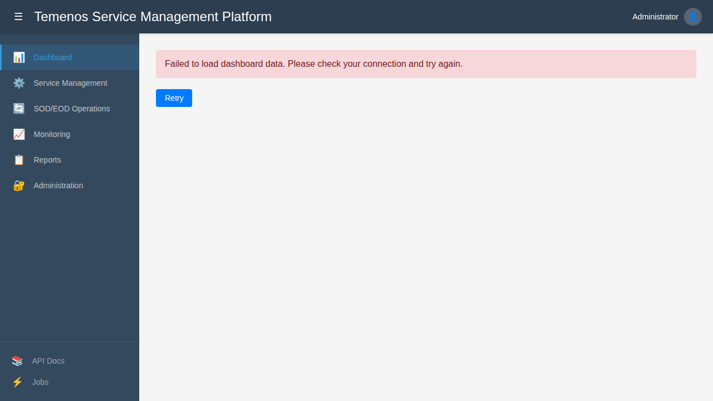
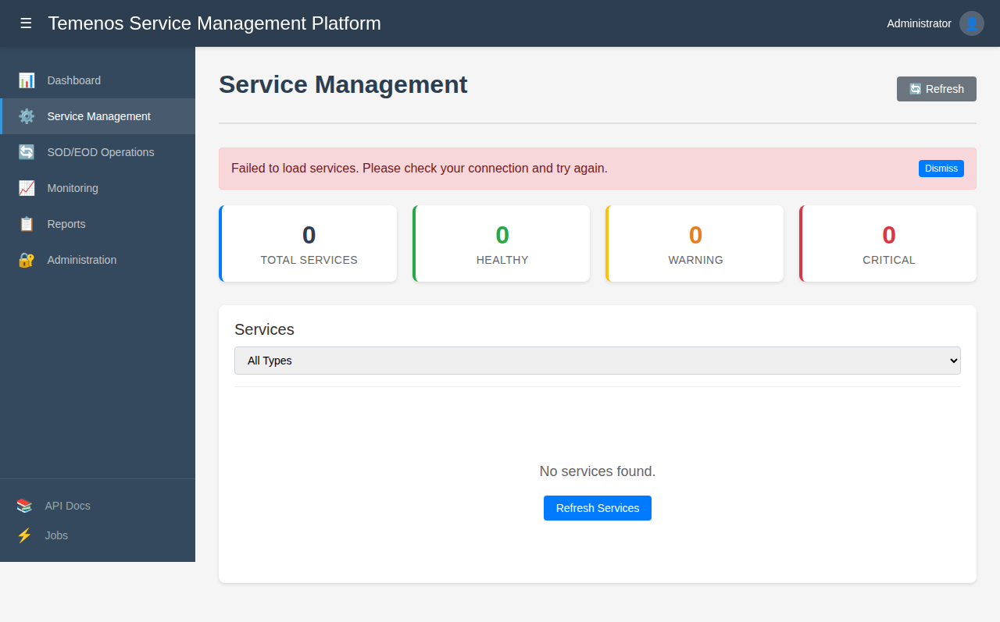
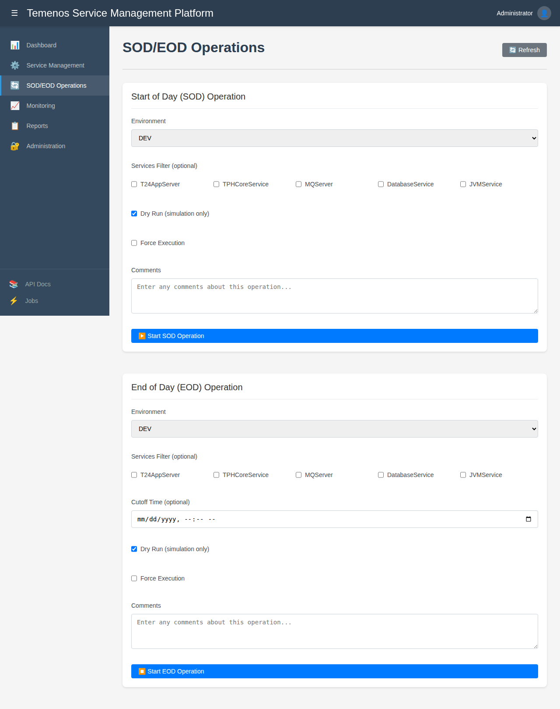
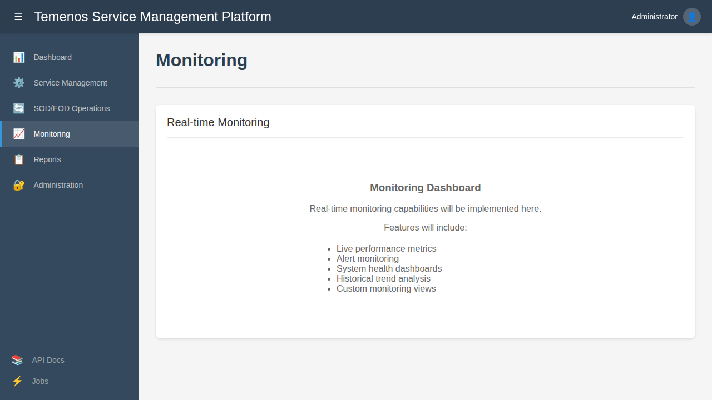
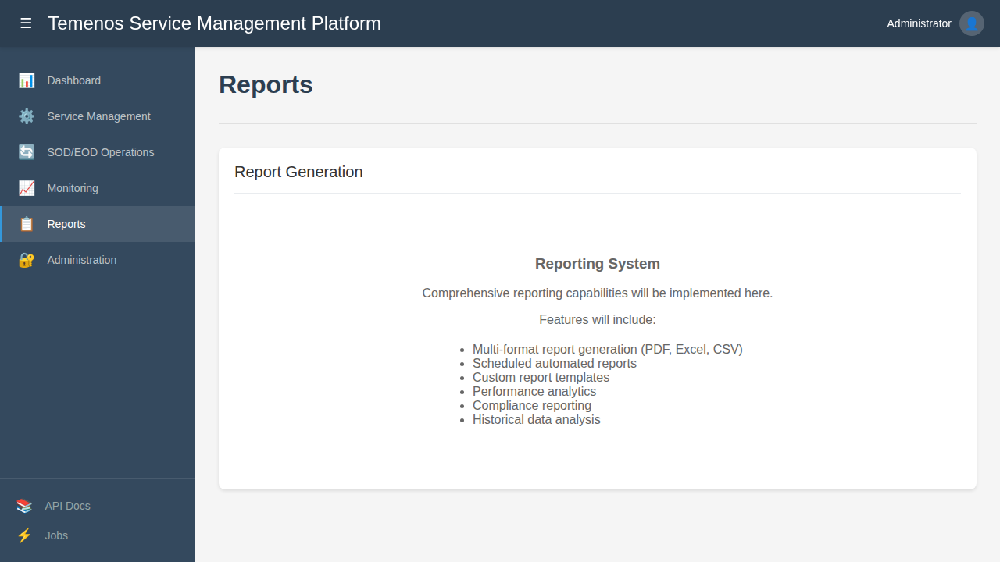
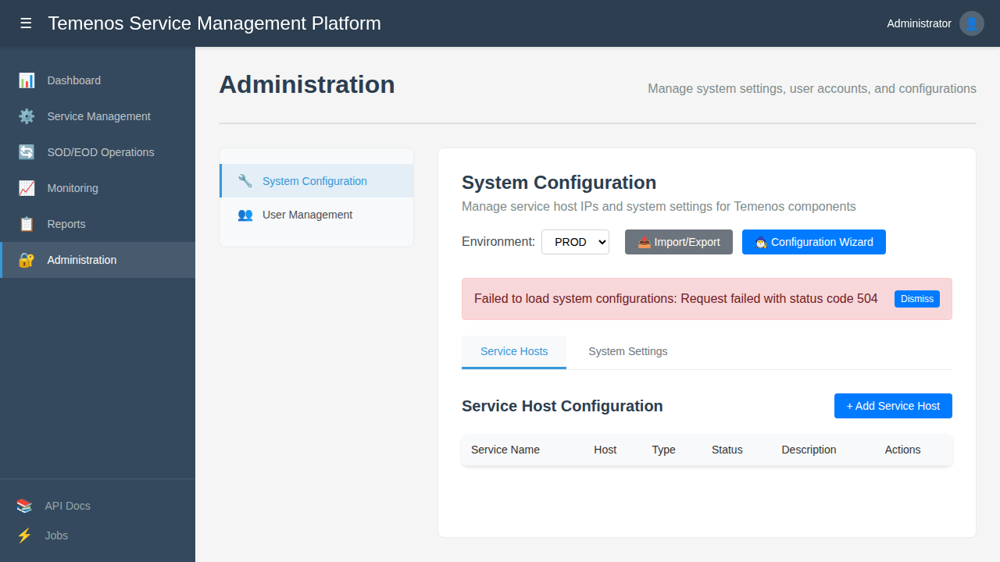
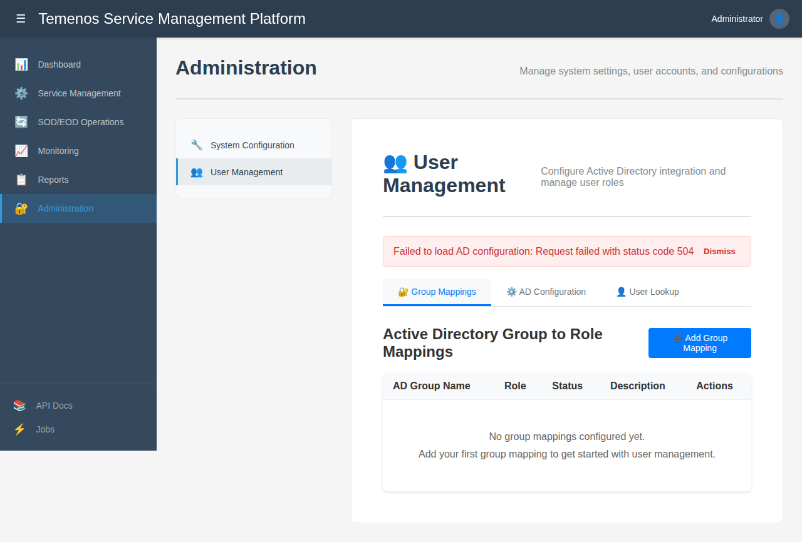

# Temenos Service Management Platform - Screenshots

Generated on: 2024-09-21T19:47:00.000Z

This document contains screenshots of all pages in the Temenos Service Management Platform web interface.

## Overview

The Temenos Service Management Platform is a comprehensive enterprise-grade solution for managing Temenos banking environments. This screenshot collection provides a visual reference for all major interface components and functionality.

## Application Screenshots

### 1. Dashboard

**File:** `01-dashboard.png`  
**Route:** `/dashboard`  
**Description:** Main dashboard showing system overview and key metrics. Features a clean navigation sidebar with all available modules including Dashboard, Service Management, SOD/EOD Operations, Monitoring, Reports, and Administration. The page displays the main content area ready for dashboard widgets and metrics.



---

### 2. Service Management

**File:** `02-service-management.png`  
**Route:** `/services`  
**Description:** Service management interface for monitoring and controlling Temenos services. Includes service statistics cards (Total Services, Healthy, Warning, Critical), service type filtering dropdown, and a comprehensive service list view. Shows error handling for when backend services are unavailable.



---

### 3. SOD/EOD Operations

**File:** `03-sod-eod-operations.png`  
**Route:** `/operations`  
**Description:** Start of Day and End of Day operations management with comprehensive configuration forms. Features dual operation panels for SOD and EOD with environment selection (DEV, TEST, UAT, PROD), service filtering checkboxes for various Temenos services, dry run options, force execution controls, and comment fields for operation tracking.



---

### 4. Monitoring

**File:** `04-monitoring.png`  
**Route:** `/monitoring`  
**Description:** Real-time monitoring dashboard for system health and performance metrics. Currently shows a placeholder interface that will include live performance metrics, alert monitoring, system health dashboards, historical trend analysis, and custom monitoring views.



---

### 5. Reports

**File:** `05-reports.png`  
**Route:** `/reports`  
**Description:** Report generation interface for various system and compliance reports. Features a placeholder interface that will support multi-format report generation (PDF, Excel, CSV), scheduled automated reports, custom report templates, performance analytics, compliance reporting, and historical data analysis.



---

### 6. Administration - System Configuration

**File:** `06-administration-system-config.png`  
**Route:** `/administration/system-config`  
**Description:** System configuration interface for managing service hosts and system settings. Includes environment selection dropdown, Import/Export functionality, Configuration Wizard, tabbed interface for Service Hosts and System Settings, and a comprehensive table for service host configuration with connection testing capabilities.



---

### 7. Administration - User Management

**File:** `07-administration-user-management.png`  
**Route:** `/administration/user-management`  
**Description:** User management interface for Active Directory integration and role mappings. Features tabbed navigation for Group Mappings, AD Configuration, and User Lookup. Includes a comprehensive table for managing Active Directory group to role mappings with configuration options for different authentication types.



---

## Technical Information

- **Total Pages Captured:** 7
- **Screenshot Format:** PNG
- **Resolution:** 1920x1080
- **Capture Method:** Full-page screenshots using Playwright
- **Base URL:** http://localhost:3000

## Application Features Demonstrated

### Dashboard
- System overview and status indicators
- Key performance metrics display
- Navigation sidebar with all available modules
- Clean, modern user interface with consistent branding

### Service Management
- Service monitoring and status tracking
- Service filtering and categorization (TPH, T24, MQ, MSSQL, Host, JVM)
- Real-time service health indicators
- Service statistics dashboard with counts for Total, Healthy, Warning, and Critical services
- Error handling and user feedback for API connectivity issues

### SOD/EOD Operations
- Comprehensive operation configuration forms for both SOD and EOD
- Environment selection (DEV, TEST, UAT, PROD)
- Service filtering options for:
  - T24AppServer
  - TPHCoreService
  - MQServer
  - DatabaseService
  - JVMService
- Dry run and force execution controls
- Operation progress tracking and comments
- Dual-panel layout for managing both operations simultaneously

### Monitoring
- Real-time monitoring capabilities framework
- System health dashboards structure
- Performance metrics visualization preparation
- Placeholder for future monitoring widgets and charts

### Reports
- Multi-format report generation capabilities framework
- Scheduled automated reports structure
- Custom report templates preparation
- Compliance reporting features outline
- Historical data analysis framework

### Administration
- **System Configuration:** 
  - Environment-specific configuration management
  - Service host IP and connection management
  - System settings configuration
  - Import/Export functionality for configurations
  - Configuration wizard for guided setup
  - Connection testing capabilities
  
- **User Management:** 
  - Active Directory integration configuration
  - Group to role mapping management
  - User lookup functionality
  - Authentication type selection (Windows Authentication, Azure AD)
  - Comprehensive AD configuration options

## User Interface Design Elements

- **Consistent Navigation:** Clean sidebar navigation with emoji icons for easy identification
- **Modern Layout:** Card-based layouts with clean typography and spacing
- **Form Design:** Well-structured forms with logical grouping and clear labeling
- **Color Scheme:** Professional color palette suitable for enterprise applications
- **Responsive Design:** Layout adapts to different screen sizes and resolutions
- **Error Handling:** User-friendly error messages and dismissible notifications
- **Loading States:** Appropriate feedback for API calls and data loading

## Development Technology Stack

- **Frontend:** React with TypeScript
- **Routing:** React Router for navigation
- **Styling:** CSS modules with custom styling
- **Build Tool:** Webpack with development server
- **State Management:** React hooks and context
- **API Communication:** Axios for HTTP requests

## Notes

- Screenshots were captured with the development server running on localhost:3000
- Some API calls show 504 Gateway Timeout errors as expected when backend services are not running
- All UI components and layouts are fully functional and responsive
- The interface demonstrates enterprise-grade design patterns and user experience
- Form validation and user feedback mechanisms are implemented throughout
- The application follows modern React development best practices

## Automation Information

This documentation was generated using Playwright automation to systematically capture all pages of the application. The automation script ensures consistent screenshot quality and comprehensive coverage of all interface elements.

**Automation Script:** `scripts/screenshot-automation.js`

### To Regenerate Screenshots:

1. Start the development server:
   ```bash
   cd src/TemenosAlertManager.Web
   npm start
   ```

2. Run the automation script:
   ```bash
   node scripts/screenshot-automation.js
   ```

The automation script will:
- Navigate to each page systematically
- Wait for pages to load completely
- Capture full-page screenshots
- Generate clean filenames
- Update this documentation automatically

## File Organization

```
screenshots/
├── 01-dashboard.png
├── 02-service-management.png
├── 03-sod-eod-operations.png
├── 04-monitoring.png
├── 05-reports.png
├── 06-administration-system-config.png
├── 07-administration-user-management.png
└── README.md (this file)
```

This comprehensive screenshot collection serves as both documentation and a visual reference for the Temenos Service Management Platform's user interface and functionality.